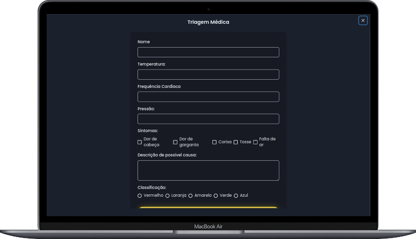
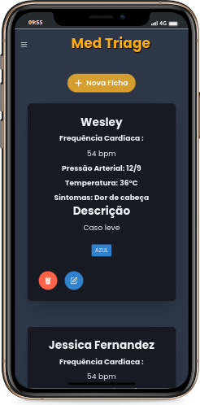

<h1 align="center"> <strong>🎯MedTriage</strong></h1>

<p align="center">

</p>

<br />

<br />
<p align="center"></p>
<p align="center"></p>
<p align="center"></p>
<br/>

# 📕 About

✍️ MedTriage is project for you to create your medical records.
</br>

# 🛠️Technologies

This project was made using the follow technologies:

- [Prisma](https://www.prisma.io/)
- [React](https://reactjs.org)
- [NextJS](https://nextjs.org/)
- [Chakra UI](https://chakra-ui.com/)

# 🚀Features

- CRUD medical record.
- Mobile responsive.

# 🏃Getting Started

```sh
# Clone API
$ git clone https://github.com/wesleywcr/MedTriage-api
```

```sh
#  Clone Repository
$ git clone  https://github.com/wesleywcr/MedTriage.git
```

```sh
# Install Dependencies
$ yarn install
# Start application
$ yarn dev
```

# 🤝 Contributing

- Fork this repository
- Create a branch with your feature: `git checkout -b my-feature`
- Commit your changes: `git commit -m 'feat: My new feature'`
- Push your branch: `git push origin my-feature`

# 📝License

Released in 2022.
Made with ❤️ by [Wesley Rodrigues](https://github.com/wesleywcr)🤙👊
